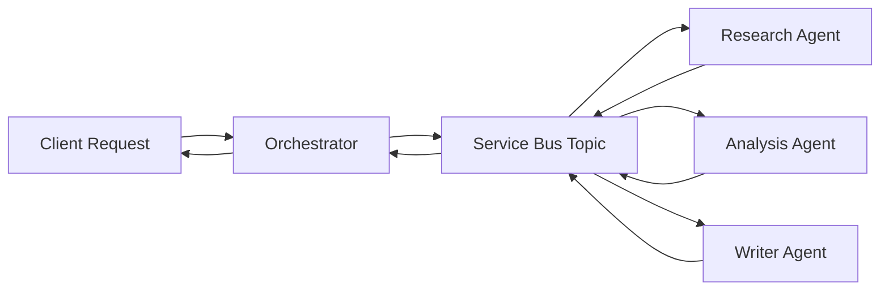
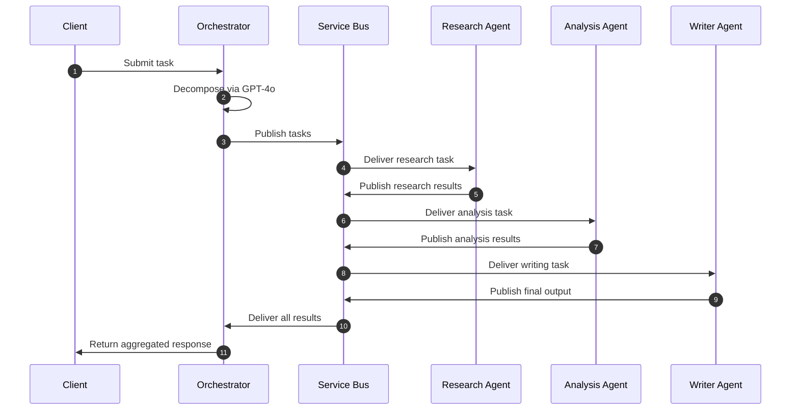
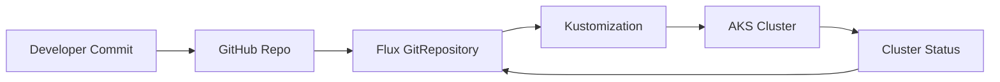
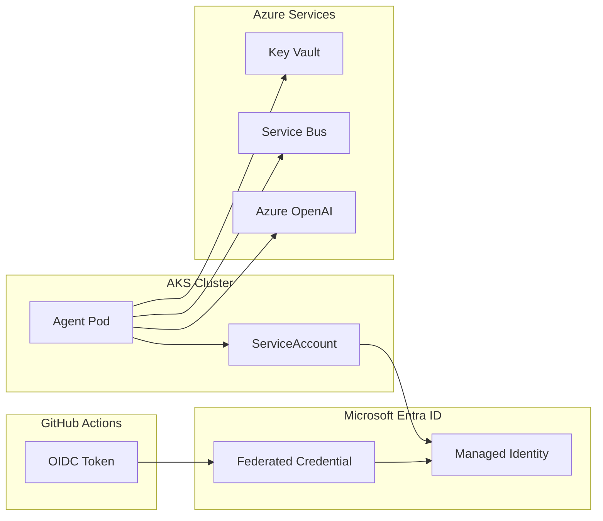

# 🚀 Azure AI Platform  
A secure, event‑driven, multi‑agent AI platform running on a private AKS cluster with zero‑trust identity, GitOps deployment, and enterprise‑grade observability.

---

## 🌐 What This Is

A production‑grade architecture demonstrating how to run multi‑agent AI workloads on Azure using:

- Private AKS  
- Azure OpenAI (GPT‑4o)  
- Azure Service Bus (event‑driven fan‑out/fan‑in)  
- Workload identity federation (no secrets)  
- GitOps with Flux CD  
- Terraform modular IaC  

The platform consists of four independent AI agents:

- **Orchestrator** — receives tasks, decomposes them with GPT‑4o, publishes work to Service Bus  
- **Research Agent** — performs structured research and summarization  
- **Analysis Agent** — identifies patterns, insights, and recommendations  
- **Writer Agent** — produces polished, human‑readable output  

All coordination is **event‑driven**. No agent calls another directly.

---

# 📐 Architecture

## 1. High‑Level Multi‑Agent Flow



---

## 2. AKS + VNet + Private Endpoints Layout

flowchart TB

Client["Client"]
APIM["API Management"]
ORCH["Orchestrator Pod"]
RES["Research Agent Pod"]
ANA["Analysis Agent Pod"]
WRI["Writer Agent Pod"]
SBTopic["Service Bus Topic"]
PEP_SB["Service Bus PE"]
PEP_KV["Key Vault PE"]
PEP_AOAI["Azure OpenAI PE"]

subgraph VNET["Azure Virtual Network"]
    subgraph AKS["AKS Private Cluster"]
        ORCH --> SBTopic
        SBTopic --> RES
        SBTopic --> ANA
        SBTopic --> WRI

        RES --> SBTopic
        ANA --> SBTopic
        WRI --> SBTopic
    end

    subgraph PrivateEPs["Private Endpoints"]
        PEP_SB
        PEP_KV
        PEP_AOAI
    end
end

ORCH --> PEP_AOAI
ORCH --> PEP_KV
RES --> PEP_KV
ANA --> PEP_KV
WRI --> PEP_KV

SBTopic --> PEP_SB

Client --> APIM
APIM --> ORCH

---

## 3. Event‑Driven Sequence Diagram



---

## 4. GitOps Flow (Flux CD)



---

## 5. Workload Identity Federation (AKS → Azure)



---

# 🔑 Key Technical Decisions

| Decision | Choice | Why |
|---|---|---|
| Auth model | Workload identity federation | Zero stored credentials |
| Network | Private endpoints + NSG deny‑all | No public surface area |
| Secrets | Key Vault CSI driver | Mounted at pod start, rotated seamlessly |
| Deployment | Flux CD (GitOps) | Cluster state reconciled from Git |
| IaC | Terraform modules | Reproducible, environment‑consistent |
| Messaging | Service Bus Premium | Private endpoint, DLQs, duplicate detection |

---

# 📁 Repository Structure

```
.
├── .github/workflows/
│   ├── infra.yml
│   └── agents.yml
├── agents/
│   ├── orchestrator/
│   ├── research-agent/
│   ├── analysis-agent/
│   └── writer-agent/
├── docs/
│   └── architecture.md
├── infra/
│   ├── modules/
│   │   ├── networking/
│   │   ├── aks/
│   │   ├── keyvault/
│   │   ├── openai/
│   │   ├── servicebus/
│   │   └── monitoring/
│   └── environments/dev/
└── k8s/
    ├── base/
    ├── overlays/dev/
    └── flux/
```

---

# 🧰 Prerequisites

- Azure subscription (Owner or Contributor + UAA)  
- Azure CLI  
- Terraform ≥ 1.7  
- kubectl  
- Azure OpenAI quota (recommended: eastus2)  

---

# 🚀 Getting Started

## 1. Bootstrap Terraform State

```bash
az group create --name rg-tfstate --location eastus2
az storage account create \
  --name sttfstate<suffix> \
  --resource-group rg-tfstate \
  --sku Standard_LRS \
  --allow-blob-public-access false

az storage container create \
  --name tfstate \
  --account-name sttfstate<suffix>
```

Enable the backend block in `infra/environments/dev/main.tf`.

---

## 2. Fill in Your Values

```bash
az ad signed-in-user show --query id -o tsv
```

Update:

```
infra/environments/dev/terraform.tfvars
```

---

## 3. Deploy Infrastructure

```bash
cd infra/environments/dev
terraform init
terraform plan
terraform apply
```

---

## 4. Populate ServiceAccount Annotations

```bash
terraform output -json agent_identity_client_ids
```

Update:

- `k8s/base/namespace.yaml`  
- `k8s/base/secret-provider-classes.yaml`  

---

## 5. Configure GitHub Actions Secrets

| Secret | Value |
|---|---|
| AZURE_CLIENT_ID | CI identity |
| AZURE_TENANT_ID | Tenant ID |
| AZURE_SUBSCRIPTION_ID | Subscription ID |
| TF_STATE_RG | rg‑tfstate |
| TF_STATE_SA | sttfstate |
| ADMIN_PRINCIPAL_ID | Your AAD object ID |
| ALERT_EMAIL | Your email |

---

## 6. Bootstrap Flux

```bash
az aks get-credentials --resource-group rg-aiplatform-dev --name aks-aiplatform-dev

kubectl create secret generic flux-github-token \
  --namespace flux-system \
  --from-literal=username=git \
  --from-literal=password=<your-github-pat>

kubectl apply -f k8s/flux/gitrepository.yaml
kubectl apply -f k8s/flux/kustomization-agents.yaml
```

---

## 7. Submit a Test Task

```bash
kubectl port-forward svc/orchestrator 8080:80 -n agents

curl -X POST http://localhost:8080/tasks \
  -H "Content-Type: application/json" \
  -d '{"prompt": "Analyse the impact of rising interest rates on commercial real estate"}'
```

---

# 📚 Architecture Documentation

See **docs/architecture.md** for:

- Component map  
- Identity model  
- Request flow  
- ADRs  
